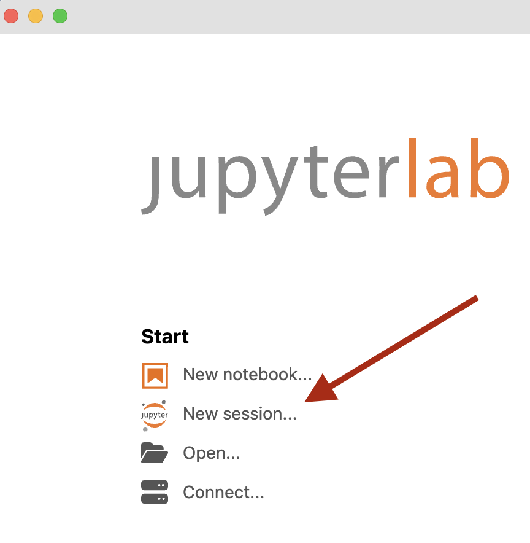

<a href="https://julialang.org"></a>

The Julia programming language is open source (and hence free) scientific computing software.  You can think of it as a modern kind of MATLAB.  

Jupyter notebooks (named for the languages **Ju**lia, **Py**thon and **R**) are a convenient way to collect and present a computation.  You can intersperse your code and output with rich [Markdown](https://commonmark.org/help/) comments.

I've written a tutorial notebook with common Julia operations to help you get up to speed, and I'll add onto it as we learn more things over the semester.

* [Julia language basics](julia/JuliaBasics.ipynb)

You can view (but not edit) notebooks, even without installing software, 
using the [nbviewer](https://nbviewer.org)
website.  Just copy the URL of the notebook you are interested in and paste it into their form.  For example, here's our [tutorial at nbviewer](https://nbviewer.org/urls/jrfaudree.github.io/LinearAlgebra2024/julia/JuliaBasics.ipynb){:target="_blank"}.

You'll want to be able to write Julia code and edit notebooks on your own computer,
and to do this you'll need to install some software.

## Julia Installation

1. JupyterLab Desktop is a convenient application for viewing and authoring Jupyter notebooks.  Follow the [installation instructions](https://github.com/jupyterlab/jupyterlab-desktop#jupyterlab-desktop){:target="_blank"} to put a copy on your computer.

2. Install Julia from an [official binary](https://julialang.org/downloads/#official_binaries_for_manual_download){:target="_blank"}.  Advanced users may prefer to use 
a [command line installer](https://julialang.org/downloads/#install_julia){:target="_blank"} instead. Take your pick.

3. Before you can start using Julia with the friendly Jupyter notebook interface,
you need to run a short command in Julia itself to activate its Jupyter 
capabilities. Launch the Julia application, which will start a command line interface like this:

   ```julia
                  _
      _       _ _(_)_     |  Documentation: https://docs.julialang.org
     (_)     | (_) (_)    |
      _ _   _| |_  __ _   |  Type "?" for help, "]?" for Pkg help.
     | | | | | | |/ _` |  |
     | | |_| | | | (_| |  |  Version 1.9.4 (2023-11-14)
    _/ |\__'_|_|_|\__'_|  |  Official https://julialang.org/ release
   |__/                   |
   
   julia> 
   ```
   At the command line, enter the following single line.

   ```julia
   import Pkg; Pkg.add("IJulia")
   ```

   Julia will then download, compile, and install the packages needed to interface with Jupyter notebooks.  This can take a bit of time; go get a coffee.

4. You can now launch the JupyterLab Desktop application and create a new notebook using the Julia kernel.

   
   


### What if something goes wrong? 🧐

Julia installation seems to be pretty reliable.  But JupyterLab Desktop may still have some kinks to be worked out, especially on Windows.

When launching a JupyterLab session for the first time, you might see 
an error such as:

<div style="border: 2px solid black; background: lightgray;">
<p style="padding:5px">
⚠️ Python environment not found <b>Install with the bundled installer</b> or <b>Change the default Python environment</b>.
</p>
</div>

If this happens, click on **Install with the bundled installer**.  Once this is done, restart JupyterLab. 🤞

In a pinch, if you are unable to install JupyterLab Desktop, you can still use Jupyter notebooks the old school way, it will just be a little clunkier.  To do so:

1. Launch command line Julia as you did when installing `IJulia`.

2. At the prompt, type `using IJulia; jupyterlab()`

The first time you do this, you will be prompted whether Julia should install 
Jupyter.  Enter `y` and press `Return` to proceed with this installation.
When the installation is done, Julia will open a web browser tab and you'll see JupyterLab running in your web browser. 🤞🤞

## Package Installation

The course text uses a few common Julia packages, and you'll need to install these right away.  If you have JupyterLab up and running successfully, you 
can copy/paste the following lines into a notebook cell.  Then hit `Shift-Return`
to execute the commands in the cell.

```julia
import Pkg
Pkg.add("LinearAlgebra")
Pkg.add("SparseArrays")
Pkg.add("Plots")
Pkg.add(url="https://github.com/VMLS-book/VMLS.jl")
```

Alternatively, you can enter these instructions in the 
same command line interface you used to install `IJulia`.

The first three packages (`LinearAlgebra`, `SparseArrays` and `Plots`) are standard Julia packages and the fourth is a special on written by the book's authors: `VMLS` stands for *Vectors, Matrices, and Least Squares* in the text's subtitle.

## Resources

* [Julia documentation](https://docs.julialang.org/en/v1/)
* Course textbook [Julia companion](https://web.stanford.edu/~boyd/vmls/vmls-julia-companion.pdf)
* Third party Jupyter notebook [companions](https://github.com/vbartle/VMLS-Companions) for every chapter of the text.
